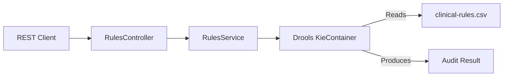

# Design Document: Drools Decision Table Implementation

## Architecture Overview

The system is built on a standard Spring Boot layered architecture, integrating the Drools Rule Engine for business logic execution.

## Key Components

### 1. Drools Configuration (`DroolsConfig.java`)
This component is responsible for:
- Initializing the Drools `KieContainer`.
- Loading the `clinical-rules.csv` resource.
- Configuring the resource type as `DTABLE` (Decision Table) and input type as `CSV`.
- **Debugging feature**: It compiles the CSV stream using `SpreadsheetCompiler` and prints the resulting DRL (Drools Rule Language) to the console during startup. This is critical for verify that the decision table is being parsed correctly.

### 2. Rule Definition (CSV Decision Table)
The core business logic is decoupled from Java code and resides in `src/main/resources/rules/clinical-rules.csv`.

**Structure Strategy:**
We use a "Split Pattern" approach for the `Person` object in the generated DRL to ensure robust parsing and correct logical AND behavior without complex cell merging in the CSV.

*   **Condition 1 (Age)**: Matches a `Person` object with a specific age range.
*   **Condition 2 (Gender)**: Matches a `Person` object (implicitly the same instance type) with a specific gender.
*   **Action**: Adds a message to the `Audit` global/fact.

**CSV Layout:**

| RuleTable Name | | | |
| :--- | :--- | :--- | :--- |
| **CONDITION** | **CONDITION** | **CONDITION** | **ACTION** |
| `Person` | `Person` | `a:Audit` | |
| `$param` | `gender == "$param"` | `eval($param)` | `a.addAudit("$param");` |
| **Age Range** | **Gender** | **Valid Audit** | **Log Message** |
| `age >= 18 && age <= 65` | `Male` | `true` | `Adult Male detected` |

**Why this structure works:**
- Defining `Person` twice in the Condition row allows Drools to generate two separate patterns like `Person(age...)` and `Person(gender...)` which are evaluated.
- The `Audit` object is bound to variable `a` so we can call methods on it in the Action column.
- The `eval(true)` column is a trick to ensure the Audit pattern is always matched if present, effectively binding the `Audit` instance to the rule context.

### 3. Service Layer (`RulesService.java`)
The service orchestrates the rule session:
1. Creates a new stateless `KieSession`.
2. Inserts the incoming `Person` fact.
3. Inserts an empty `Audit` result accumulator.
4. Fires all matching rules.
5. Disposes the session.
6. Returns the populated `Audit` object.

## Data Flow

1. **Input**: JSON payload `{"name": "...", "age": 25, "gender": "Female"}`
2. **Controller**: Deserializes JSON to `Person` POJO.
3. **Execution**: 
    - `Person` + Empty `Audit` inserted into Working Memory.
    - Drools Engine matches facts against CSV-defined rules.
    - If matches found (e.g., Age 25 is in `18..65` range), Action executes: `audit.addAudit(...)`.
4. **Output**: `Audit` object with list of messages returned as JSON.

## Extensibility

- **Adding Rules**: Simply add new rows to `clinical-rules.csv`. No code recompilation needed (application restart required to reload rules in this basic setup).
- **New Object Types**: Add columns to the CSV and update the header rows to bind new POJO types (e.g., `MedicalHistory`).
